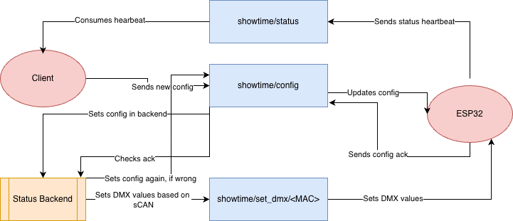

# 🎬 Showtime: LED Design & Control System

[](https://www.rust-lang.org/)
[](https://mqtt.org/)
[](https://github.com/emilk/egui)
[](https://www.docker.com/)

**Showtime** is a high-performance, real-time ecosystem for monitoring and controlling ESP32-based LED controllers. It combines professional lighting protocol support (sACN) with a modern, native management interface—allowing you to synchronize hundreds of devices with ease.



---

## 🏗️ Ecosystem Components

- **Desktop Client (Rust/egui):** A high-performance dashboard for real-time monitoring, device health tracking, and remote configuration.
- **Server-Worker (Rust):** A headless powerhouse that translates sACN (E1.31) Unicast data into efficient MQTT commands and enforces device configurations.

---

## ✨ Features

- **sACN to MQTT Translation:** Map professional lighting consoles (QLC+, GrandMA, Onyx) directly to ESP32 pins.
- **Live Device Configuration:** Change device names, DMX universes, and LED counts on-the-fly without reflashing hardware.
- **Real-Time Monitoring:** Native, hardware-accelerated UI that visualizes signal strength, power status, and sACN jitter.
- **Persistence:** All device configurations are stored and enforced by the Server-Worker.
- **Containerized:** Deploy the Server-Worker easily using Docker.

---

## 🚀 Quick Start

### 1. Start Infrastructure
Launch the MQTT Broker:
```bash
docker compose up -d
```

### 2. Run Server-Worker
The worker handles sACN input and configuration enforcement.
```bash
cd server-worker
cargo run
```

### 3. Run Desktop Client
```bash
cd client
cargo run
```

### 4. Connect sACN Source
Point your sACN sender (e.g., QLC+) via **Unicast** to the IP of the Server-Worker (Default Port: 5568).

---

## 📡 Topic Architecture

The system communicates via a structured MQTT hierarchy:

- `showtime/status`: ESP32 devices report their health and current state.
- `showtime/config`: Distributed configuration updates for device settings.
- `showtime/set_dmx/<MAC>`: High-speed DMX data packets for individual controllers.

---

## 🛠️ Development & Deployment

### Simulation
Test the system without hardware:
```bash
# In a new terminal
cd test_client
pip install paho-mqtt protobuf
python sim.py
```
